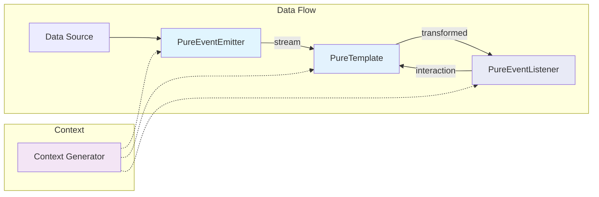
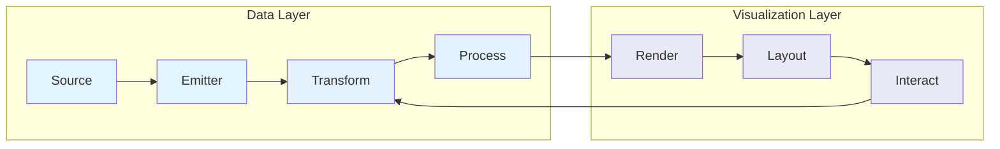
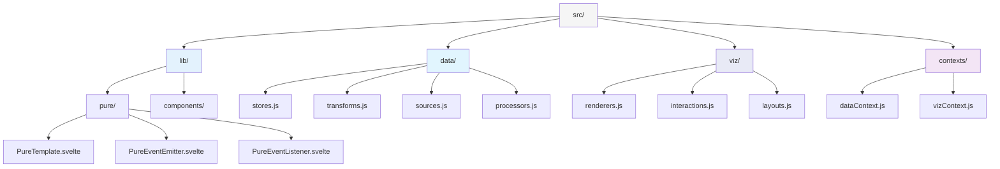
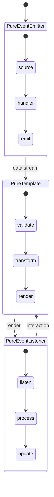

# Pure Template Architecture

## Core Flow
This diagram shows the basic flow between pure components:

## Data Transformation
Here's how data flows through the transformation pipeline:

## Project Structure
The project follows this directory structure:

## Component Composition
Components compose together following this pattern:

