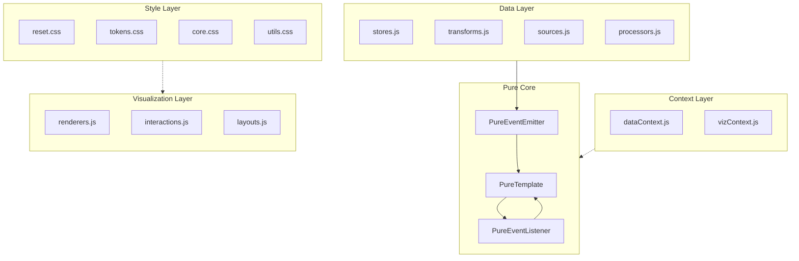
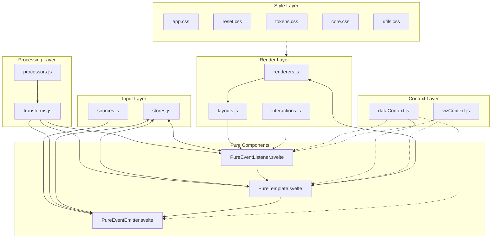

# Complete Architecture Guide





## Directory Structure
```
src/
  lib/
    pure/               # Our three pure base components
      PureTemplate.svelte
      PureEventEmitter.svelte
      PureEventListener.svelte
    components/         # Reusable composed components
      DataView.svelte
      InteractiveChart.svelte
      ...
  data/                # Pure data layer
    stores.js
    transforms.js
    sources.js
    processors.js
  viz/                 # Pure visualization layer
    renderers.js
    interactions.js
    layouts.js
  contexts/            # Context definitions
    dataContext.js
    vizContext.js
  routes/              # Pages/routes using pure components
    +page.svelte
    chart/+page.svelte
    ...
```

## Data Layer (src/data/)

### stores.js
Primary data structures and state containers. Contains only pure data, no UI logic.
```javascript
// Examples:
- Raw data arrays/objects
- Configuration state
- Data indices/maps
- Cached computations
- Data relationships
```

### transforms.js
Pure functions that transform data from one form to another. No side effects.
```javascript
// Examples:
- Data normalization
- Format conversions
- Mathematical operations
- Data structure conversions
- Filter operations
```

### sources.js
Defines how data enters the system. Pure setup functions for data streams.
```javascript
// Examples:
- WebSocket connectors
- Event stream creators
- Polling mechanisms
- File readers
- API connectors
```

### processors.js
Stateless data processing pipelines. Transform streams or batches of data.
```javascript
// Examples:
- Stream aggregators
- Window operations
- Batch processors
- Data validators
- Pipeline composers
```

## Visualization Layer (src/viz/)

### renderers.js
Pure functions that convert data to visual representations.
```javascript
// Examples:
- SVG element generators
- Canvas drawing functions
- Chart element creators
- Visual primitive generators
- Style calculators
```

### interactions.js
Pure handlers for user interactions. Transform events into data operations.
```javascript
// Examples:
- Mouse/touch handlers
- Gesture recognizers
- Selection handlers
- Drag operations
- Zoom calculations
```

### layouts.js
Pure functions that compute positions and arrangements.
```javascript
// Examples:
- Grid layouts
- Force-directed layouts
- Tree layouts
- Stack/flow layouts
- Positioning algorithms
```

## Context Layer (src/contexts/)

### dataContext.js
Context generators for data operations. Provides data processing configuration.
```javascript
// Examples:
- Data formats
- Processing parameters
- Validation rules
- Transform configurations
- Operation metadata
```

### vizContext.js
Context generators for visualization. Provides rendering configuration.
```javascript
// Examples:
- Viewport state
- Style themes
- Animation settings
- Interaction modes
- Display configurations
```

## Component Layer (src/lib/)

### pure/
The three fundamental pure components. Never modified directly.
```javascript
// Contents:
- PureTemplate.svelte     // Pure transformation component
- PureEventEmitter.svelte // Pure event source component
- PureEventListener.svelte // Pure interaction component
```

### components/
Reusable compositions of pure components. Build higher-level features.
```javascript
// Examples:
- DataViews
- Charts
- Forms
- Interactive elements
- Visualization containers
```

## Key Principles

1. **Data Layer Purity**
   - Only data structures and operations
   - No UI/visualization logic
   - Pure functional transforms
   - Clear data flow paths

2. **Visualization Layer Purity**
   - Only visual operations
   - No data business logic
   - Pure render functions
   - Clear visual hierarchy

3. **Context Separation**
   - Clear boundary between data/viz
   - Explicit configuration passing
   - No shared global state
   - Pure context generation

4. **Component Composition**
   - Build from pure bases
   - Clear responsibility chain
   - Explicit data flow
   - Reusable patterns

## Usage Guide

1. **Start with Data**
   - Define data structures in stores
   - Create pure transforms
   - Setup data sources
   - Define processors

2. **Add Visualization**
   - Create pure renderers
   - Define interactions
   - Setup layouts
   - Build visual hierarchy

3. **Connect with Context**
   - Define data context
   - Define viz context
   - Create context generators
   - Setup composition flow

4. **Compose Components**
   - Use pure base components
   - Create specific compositions
   - Build reusable patterns
   - Maintain separation

Would you like me to:
1. Add more specific examples for each layer?
2. Show complex component compositions?
3. Demonstrate specific data flows?
4. Explain testing strategies?